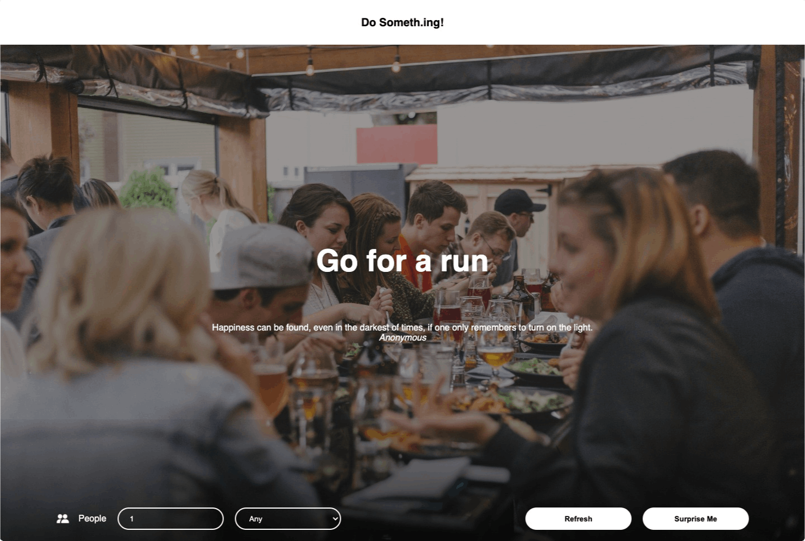

# DoSometh.ing

[See Live](https://pensive1.github.io/Do-Something/)

---

## Summary

DoSometh.ing is a single-page website that recommends activities based on a given number of people and category.

## Background

A month into Brainstation’s Software Development boot camp, all students were challenged to produce a mini project for our first 24hr hackathon. Up till then, we learnt web development fundamentals, HTTP and how to APIs.

## How it works

### Content

Activities are provided by the [bored API](https://www.boredapi.com/). The motivational quote comes from GoProgram’s [inspiration quote API](https://api.goprogram.ai/inspiration/docs/). The inspirational quote refreshes every hour. When the page loads, a random activity and quote are generated.

When filter value changes, a new suggestion is generated. If a suggestion isn’t available, the page lets you know with a polite notice.

### Filters

- **People:** Shows activities based on a given number of people **(on change)**. _Without a category, a random activity with `n` people is shown_.

- **Category:** This narrows down a suggestion to a category **(on change)**. Additional suggestions can’t be generated if the number of people is empty.

#### Buttons

- **Refresh:** Generates a new suggestion for a given amount of people and/or category.

- **Surprise me:** Clears filters and generates a random suggestion

---

## Tech Stack

- HTML 5
- CSS 3
- Sass
- Javascript
- Axios Library
